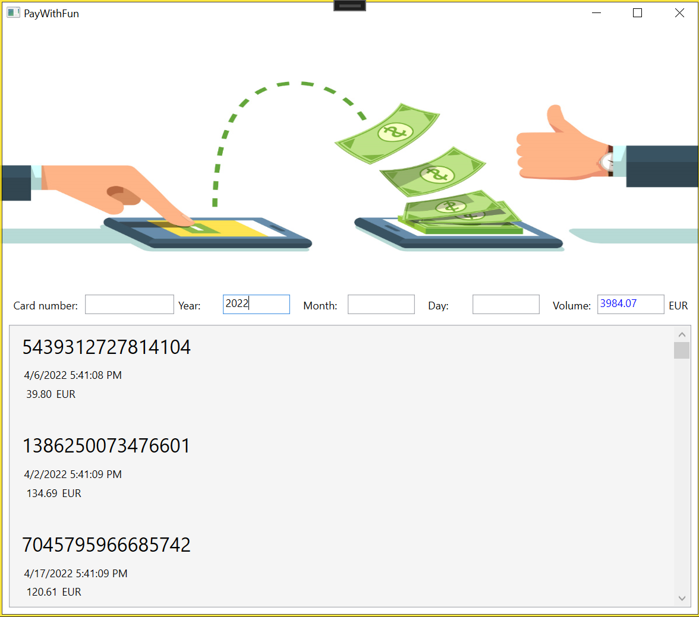

  
# QTPayWithFunLight  
  
**Inhaltsverzeichnis**  
1. [Einleitung](#einleitung)  
2. [Datenmodell und Datenbank](#datenmodell-und-datenbank)  
3. [Aufgaben](#aufgaben)  
   1. [Backend-System](#backend-System)  
      1. [Business-Logic](#business-logik)  
      2. [Unit-Tests](#unit-tests)  
      3. [RESTFul-Service](#restful-service)  
   2. [AspMvc-Views](#aspmvc-views)  
   3. [WpfApp-Report](#wpfapp-report)  
  
## Einleitung  
  
Das Projekt ***QTPayWithFunLight*** ist eine datenzentrierte Anwendung zur Verwaltung von Kreditkarten Zahlungen.   
  
Zu entwickeln ist das Backend-System mit der Datenbank-Anbindung, eine Web-Anwendung zur Verwaltung der Stammdaten der Projekte. Zusaetzlich soll ein mobiler Client zum Ansehen und Bearbeiten einer Aufgabe erstellt werden.  
  
## Datenmodell und Datenbank  
  
Das Datenmodell fuer ***QTPayWithFunLight*** hat folgenden Aufbau:  
  
```txt  
  
+-------+--------+   
|                |   
|    Payment     +   
|                |   
+-------+--------+   
  
```  
  
### Definition von ***Payment***  
  
| Name | Type | MaxLength | Nullable |Unique|Db-Field|Access|  
|------|------|-----------|----------|------|--------|------|  
| Id | int |---|---|---| Yes | R |  
| RowVersion | byte[] |---| No |---| Yes | R |  
| Date* |DateTime | --- | No | No | Yes | R |  
| CreditCardNumber** | String | 16 | No | No | Yes | RW |  
| Amount | double | --- | No| No | Yes | RW |  
| Note | String | 1024 | Yes | No | Yes | RW |  
  
*Datum der Erstellung  
**Die Kreditkartennummer muss auf Gueltigkeit geprueft werden.  
  
## Aufgaben  
  
### Backend-System  
  
Erstellen Sie das Backend-System mit der Vorlage ***QuickTemplate*** und definieren die folgenden ***Komponenten***:  
  
- Erstellen der ***Enumeration***  
  - *keine*  
- Erstellen der ***Entitaeten***  
  - *Payment*  
- Definition des ***Datenbank-Kontext***  
  - *DbSet&lt;Payment&gt;* definieren  
  - partielle Methode ***GetDbSet<E>()*** implementieren  
- Erstellen der ***Kontroller*** im *Logic* Projekt  
  - ***PaymentsController***  
- Erstellen der ***Datenbank*** mit den Kommandos in der ***Package Manager Console***  
  - *add-migration InitDb*  
  - *update-database*  
- Implementierung der ***Business-Logic***  
  - Ueberpruefen der Geschaeftslogik mit ***UnitTests***  
- Importieren von Daten (optional)  
  
#### Business-Logik  
  
Das System muss einige Geschaeftsregeln umsetzen. Diese Regeln werden im Backend implementiert und muessen mit UnitTests ueberprueft werden.   
  
> **HINWEIS:** Unter **Geschaeftsregeln** (Business-Rules) versteht man **elementare technische Sachverhalte** im Zusammenhang mit Computerprogrammen. Mit *WENN* *DANN* Scenarien werden die einzelnen Regeln beschrieben.  
  
Fuer das ***QTPayWithFunLight*** sind folgende Regeln definiert:  
  
| Rule | Subject | Type | Operation | Description | Note |  
|------|---------|------|-----------|-------------|------|  
|**A1**| Payment | | | | |  
| | |**WENN**| | eine Bezahlung erstellt wird, | |  
| | |**DANN**| | wird das Datum vom System mit dem aktuellen Datum gesetzt | |  
| | | | UND | die Kreditkartennummer muss auf Gueltigkeit geprueft werden. | |  
|**A2**| Payment | | | | |  
| | |**WENN**| | ein Bezahlung bearbeitet wird, | |  
| | |**DANN**| | darf das Datum nicht mehr geaendert werden | |  
| | | | UND | die Kreditkartennummer muss auf Gueltigkeit geprueft werden. | |  
  
> Wenn die Regeln nicht eingehalten werden, dann wird eine Ausnahme geworfen.  
  
**Pruefung der Kreditkartennummer**  
  
Die Kreditkartennummer (16 Stellen) ist durch eine Pruefziffer (16. Stelle, die bei der Berechnung nicht mitverwendet wird) wie folgt gegen Fehleingaben abgesichert:   
•	Die Ziffern an den Stellen mit gerader Nummer (beginnend bei 0) werden verdoppelt und deren Ziffernsumme wird aufsummiert  
•	Die Ziffern an den Stellen mit ungerader Nummer werden aufsummiert  
•	Die beiden erhaltenen Zahlen werden addiert und die Differenz zur naechsten Zehnerzahl wird ermittelt, die gleich groß oder groeßer ist als die Summe. Diese Ziffer (0-9) ist die Pruefziffer  
  
Ein Beispiel fuer die Kreditkartennummer 2718 2818 2845 8567:  
  
|  4 |    |  2 |    |  4 |    |  2 |    |  4 |    |  8 |    | 16 |    | 12 | PZ |    | 34 |  
|----|----|----|----|----|----|----|----|----|----|----|----|----|----|----|----|----|----|  
| 2  |	7 | 1  |  8 |  2 |  8 |  1 |  8 |  2 |	8 |  4 |  5 |  8 |  5 |  6 |**7**|   |    |  
|    |  7 |    |  8 |    |  8 |    |  8 |    |  8 |    |  5 |    |  5 |    |    | +  | 49 |  
|    |    |    |    |    |    |    |    |    |    |    |    |    |    |    |    | =  | 83 |  
|    |    |    |    |    |    |    |    |    |    |    |    |    |    |    | PZ | -> |**7**|  
  
PZ...Pruefziffer  
  
Weitere gueltige Kreditkartennummern:  
  
5012562444244093 0431056315108911 6552641896002748 7238566863870647 6443869235864592 4457886045078989 7115966897700372 0136831385049882 9024764852856909 8576583214583082  
  
#### Unit-Tests  
  
All diese Geschaeftsregeln muessen mit **UnitTests** ueberprueft werden. Fuegen Sie dazu zur Loesung (Solution) ein Projekt mit dem Namen ***'QTPayWithFunLight.Logic.UnitTest'*** hinzu und implementieren Sie die Tests.  
   
#### RESTful-Service  
  
Erstellen Sie einen REST-Service Zugriff fuer die Entitaet ***'PayWithFun'*** mit folgende Komponenten:  
  
- Ein ***Model*** fuer die Entitaet ***'Payment'***.  
- Einen ***Kontroller*** mit den folgenden Operationen  
  - Abfrage alle Payments  
  - Abfrage eines Payments mit der Id  
  - Erstellen eines Payments (...)  
  - Aenderung eines Payments (...)  
  - Loeschen eines Payments (mit Rückfrage)  
  
##### Zusaetzliche Abfragen von Bezahlungen  
  
````csharp  
/// <summary>  
/// This query determines the payments depending on the parameters.  
/// </summary>  
/// <param name="creditCardNumber">The credit card number (optional)</param>  
/// <param name="year">The year (optional)</param>  
/// <param name="month">The month (optional)</param>  
/// <param name="day">The day (optional)</param>  
/// <returns>The result of the query.</returns>  
[HttpGet("queryBy", Name = nameof(QueryByAsync))]  
[ProducesResponseType(StatusCodes.Status200OK)]  
public async Task<ActionResult<IEnumerable<Models.Payment>>> QueryByAsync(  
    [FromQuery(Name = "cardNumber")] string? creditCardNumber,  
    [FromQuery(Name = "year")] int? year,  
    [FromQuery(Name = "month")] int? month,  
    [FromQuery(Name = "day")] int? day)  
{  
    throw new NotImplementedException();  
}  
````  
  
````csharp  
/// <summary>  
/// The query calculates the turnover depending on the parameters.  
/// </summary>  
/// <param name="creditCardNumber">The credit card number (optional)</param>  
/// <param name="year">The year (optional)</param>  
/// <param name="month">The month (optional)</param>  
/// <param name="day">The day (optional)</param>  
/// <returns>The volumn</returns>  
[HttpGet("queryVolumeBy", Name = nameof(QueryVolumeByAsync))]  
[ProducesResponseType(StatusCodes.Status200OK)]  
public async Task<ActionResult<decimal>> QueryVolumeByAsync(  
    [FromQuery(Name = "cardNumber")] string? creditCardNumber,  
    [FromQuery(Name = "year")] int? year,  
    [FromQuery(Name = "month")] int? month,  
    [FromQuery(Name = "day")] int? day)  
{  
    throw new NotImplementedException();  
}  
````  
  
Pruefen Sie mit dem Werkzeug Swagger die REST-Schnittstelle.  
  
### AspMvc-Views  
  
Erstellen Sie fuer die folgenden Entitaeten Ansichten im AspMvc-Projekt:  
  
> Der Kontroller ***PaymentsContoller*** ist bereits erstellt.  
  
- ListView - Uebersicht der Bezahlungen  
- Create - Erstellen einer Bezahlung  
- Edit - Bearbeiten einer Betahlung  
- Delete - Loeschen einer Bezahlung mit Rueckfrage  
  
### WpfApp-Report  
  
Erstellen Sie fuer die Auswertung der Umsaetze eine Wpf-Anwendung mit folgendem Layout:  
  
  
  
Die Aktualisierung der Umsaetze erfolgt unmittelbar nach einer Aenderung der Filterkriterien:  
  
- Card number (Kreditkartennummer)  
- Year (Jahr)  
- Month (Monat)  
- Day (Tag)  
  
Die Anzeige `Volumne` zeigt den Umsatz fuer die aktuelle Filtereingabe an.  
  
**Viel Spaß beim Umsetzen der Aufgabe!**  
